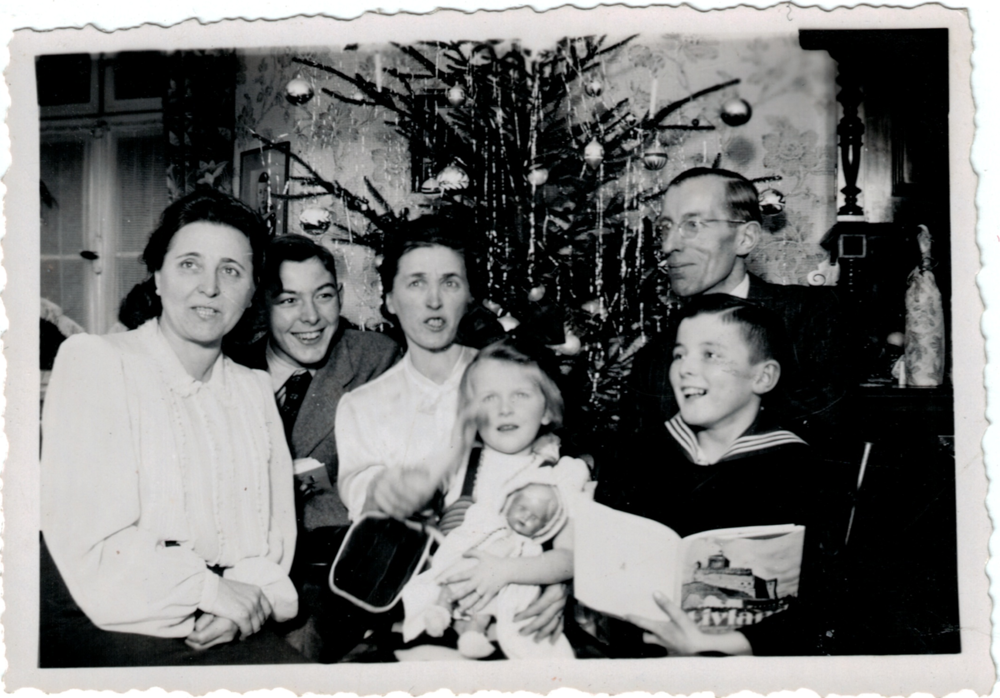
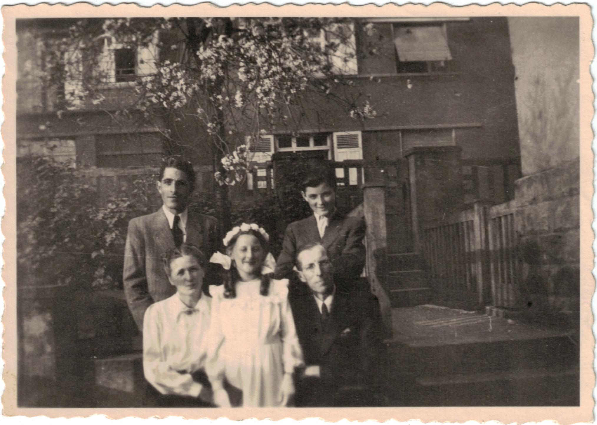

# ScanCropper

ScanCropper is a Python script designed to identify, crop, and correctly orient photographs in scanned images (".jpg", ".jpeg", ".png", ".bmp"). It is particularly suited for finding rectangular images on a white background. It can handle multiple photos in a single scan and process multiple scanned images at once, meaning you don't have to perfectly align the photos in your scanner.

## Use Case Example

Suppose you have a photo album and you scan 2 photos at a time, leaving some space between them on the scanner. Simply run the script with the `--photos-per-scan 2` option on your scanned files. For each file it processes, it will output 2 individual, cropped, and correctly oriented photos from the scan.






## Requirements

- Python 3.6 or above
- OpenCV
- NumPy

You can install the required Python packages with pip:

```bash
pip install opencv-python-headless numpy
```

## Usage

Navigate to the directory containing the ScanCropper script:

```bash
cd /path/to/ScanCropper
```

Run the script, specifying the input directory (containing your scanned images) and the output directory (where the cropped images will be saved):

```bash
python scan_cropper.py --dir /path/to/input/dir --odir /path/to/output/dir
```

You can customize the processing with several options:

    `--num-threads`             or  `-n`    Number of threads to use (default: system number of cores).
    `--pic-size-diff`           or  `-s`    Approximate size difference between scanned images, as a percent. Set lower if images are of varying sizes (default: 0.80).
    `--thresh`                  or  `-t`    Threshold value for determining photo edges. Use higher values for brighter images, lower for tighter cropping (default: 230).
    `--photos-per-scan`         or  `-i`    Number of photos to look for per scanned image (default: 1).
    `--blur`                    or  `-b`    Amount of blur to apply when processing. Different values may affect how well scans are found and cropped. Must be an odd number greater than 1 (default: 9).
    `--output-file-name-prefix` or  `-p`    Prefix string to append to the start of output image file names.


## Credit
This project is an up to date version of https://github.com/kosenina/ScannedImageMultiCrop/tree/master.

Usefull links:

    https://github.com/polm/ndl-crop
    https://flothesof.github.io/removing-background-scikit-image.html
    https://github.com/Claytorpedo/scan-cropper/
